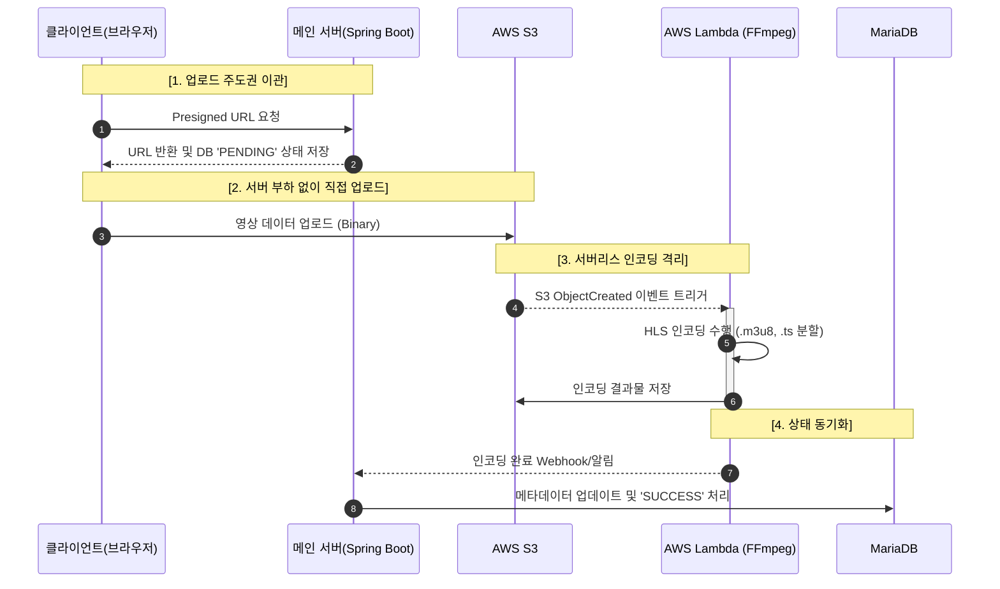

 
 

  영상을 스트리밍하고 하나의 영상을 함께 시청할 수 있는 플랫폼

---
# 📌 프로젝트 소개

> **"혼자 보는 영상에서 함께하는 경험으로"**

프로젝트 '다봄'은 '다' 같이 '본다'는 뜻으로 단순한 영상 시청을 넘어 실시간 공유와 소통이 가능한 스트리밍 서비스입니다.

영상 콘텐츠와 실시간 채팅, 동시 시청 기능을 결합하여 새로운 형태의 디지털 공동체 경험을 제공합니다.

- 기간: 2025.06 ~ 2025.09
- 구성: 5인 팀 프로젝트 / 팀원

### 🔗 배포 링크

[서비스 링크](https://www.dabom-together.kro.kr)

[프론트엔드 레포지토리](https://github.com/tipsyboy/FlowBox-DaBom-FE)

### 🫂 팀원

<table align="center">
  <tbody>
    <tr>
      <td align="center"><a href="https://github.com/raccoon-coding"> <b>팀원: 최민성</b></a></td>
      <td align="center"><a href="https://github.com/tipsyboy"> <b>팀원: 양형모</b></a></td>
      <td align="center"><a href="https://github.com/flionme"> <b>팀원: 김성인</b></a></td>
      <td align="center"><a href="https://github.com/Hanryang-Kim"> <b>팀원: 김륜환</b></a></td>
      <td align="center"><a href="https://github.com/kbw07"> <b>팀원: 강병욱</b></a></td>
    </tr>
  </tbody>
</table>

---

# 🙋 담당

[비디오 도메인 개발기 Wiki](https://github.com/tipsyboy/FlowBox-DaBom-BE/wiki/%EB%B9%84%EB%94%94%EC%98%A4-%EB%8F%84%EB%A9%94%EC%9D%B8-%EA%B0%9C%EB%B0%9C%EA%B8%B0)

## 👤 역할
- **Backend**: 비디오 도메인 / 업로드 / 스트리밍 / 인코딩 파이프라인 설계 및 구현
- **Frontend**: 비디오 플레이어 및 채널 내 비디오 관련 화면 개발

## 🔥 주요 기여
### 1️⃣ AWS S3 도입 및 Presigned URL 기반 업로드 구조 전환

#### 문제 인식
- 로컬 저장소는 미디어 서비스 특성상 용량 한계가 있고 업로드 용량 변경 시 서버 설정에 의존하는 구조적 제약 존재 파악
- 서버가 파일을 직접 수신하는 구조에서 대용량 업로드 시 CPU 점유율이 약 15%까지 증가하는 병목 확인

#### 해결
- 저장소의 확장성과 유연성을 확보하기 위해 AWS S3로 저장소 이관
- 서버를 경유하지 않고 클라이언트가 직접 업로드하도록 Presigned URL 방식 적용

#### 결과
- 서버 CPU 사용량 15% → 3% 감소
- 업로드 처리로 인한 서버 부하 제거 및 안정성 확보
- 제한된 URL 기반 접근 제어로 업로드 보안성 향상

### 2️⃣ HLS 기반 스트리밍 파이프라인 구축

#### 문제 인식
- HTTP 206(Partial Content) 기반 스트리밍은 사용자 네트워크 환경에 따라 끊김이 발생하는 한계 존재

#### 해결
- 적응형 스트리밍을 지원하는 HLS 방식 도입
- FFmpeg을 활용하여 원본 영상을 `.ts` 세그먼트와 `.m3u8` 인덱스로 변환하는 인코딩 파이프라인 구성

#### 결과
- 다양한 네트워크 환경에서도 안정적인 스트리밍 제공
- 사용자 환경에 따라 자동으로 품질이 조절되는 재생 구조 확보

### 3️⃣ 서버리스 인코딩 파이프라인 구축

#### 문제 인식
- FFmpeg 인코딩 수행 시 CPU 급등 및 메모리 사용량이 500MB → 2500MB까지 증가
- `@Async` 기반 비동기 처리로 응답 속도는 개선되었으나 서버 부하는 동일하게 유지
- 동시 업로드 상황에서 OOM 발생 가능성 확인 → 인프라 레벨 분리 필요

#### 해결
- 수직 확장, 수평 확장, 전용 인코딩 서버 분리 등 여러 방안을 검토
- 인코딩 작업을 서버 외부로 분리하기 위해 AWS Lambda 기반 서버리스 구조 선택
- S3 업로드 이벤트를 트리거로 Lambda에서 FFmpeg 인코딩 후 결과를 S3에 저장하는 파이프라인 설계

#### 결과
- 인코딩 작업을 메인 서버와 완전히 분리하여 자원 격리 달성
- 대용량 영상 동시 업로드 상황에서도 서버 안정성 유지
- 실행 시간 기반 과금 구조를 활용해 비용 효율적인 처리 가능

#### 파이프라인

# 🛠 기술 스택
## Back-end

## DB

## Infra

## Video Processing

## Front-end

